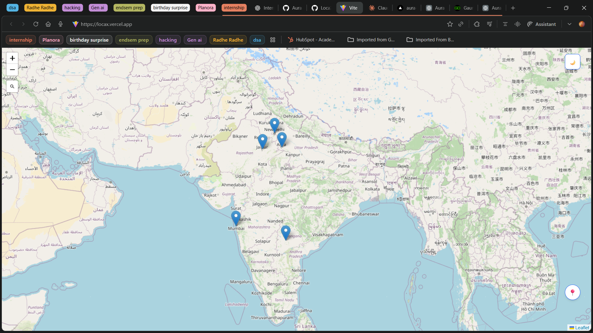
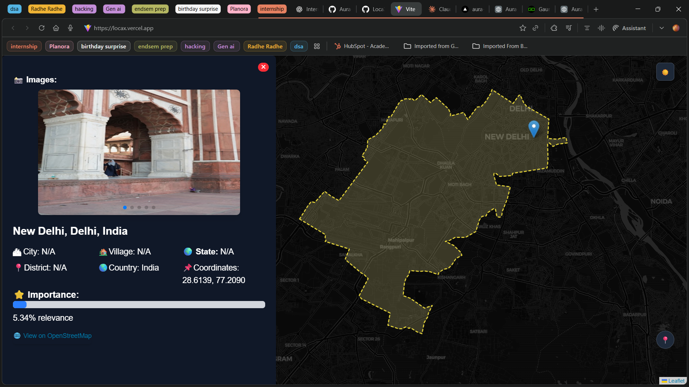
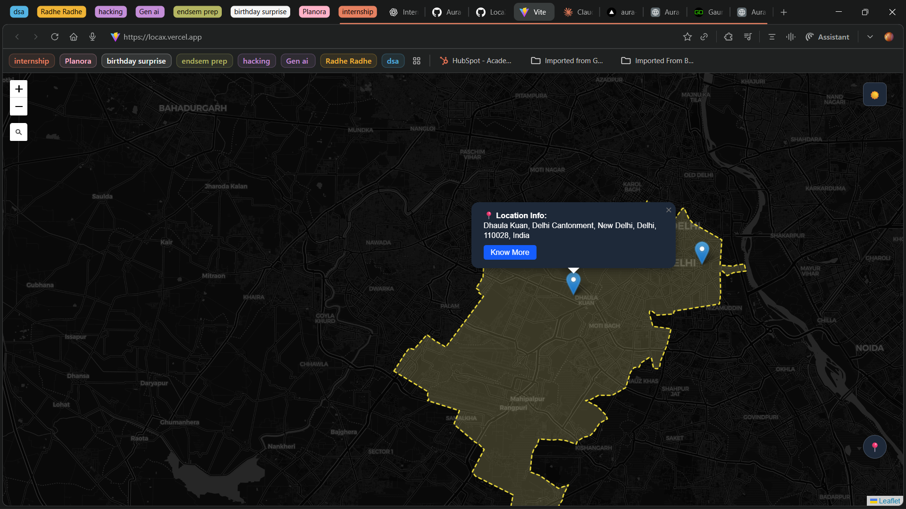
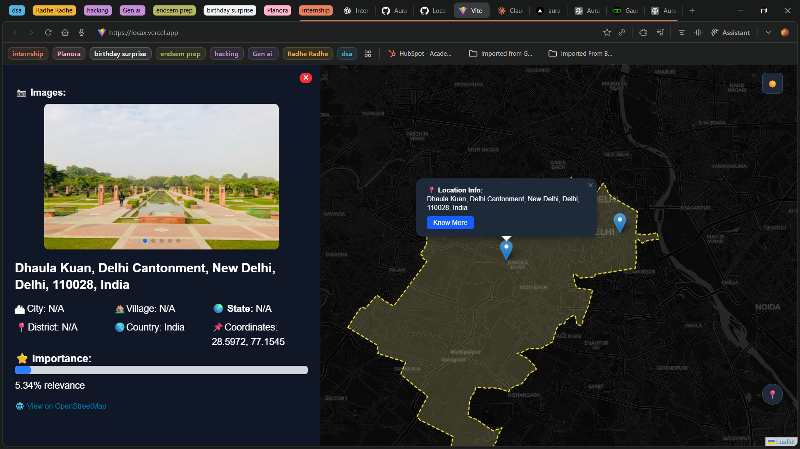
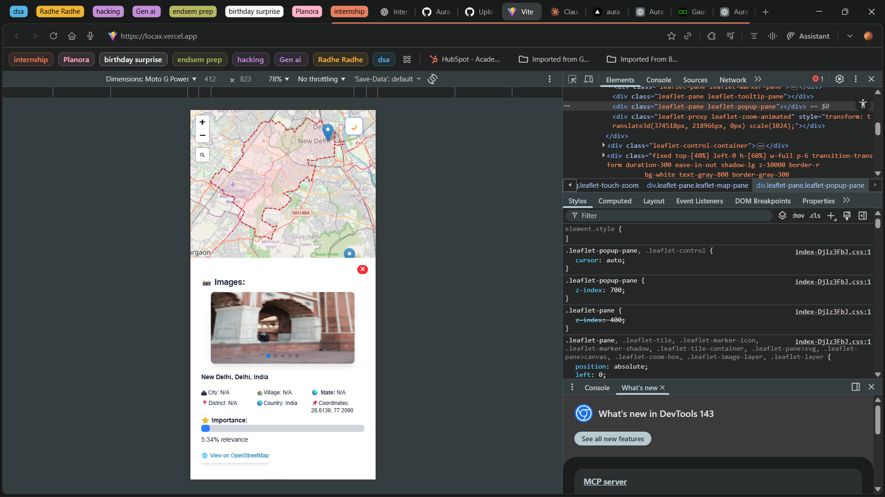
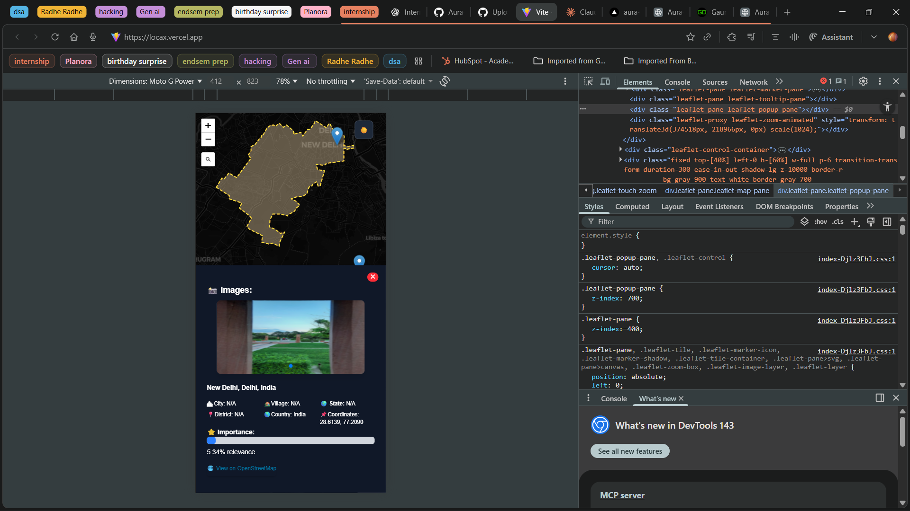

# LocaX 🗺️

LocaX is an interactive location exploration web application that allows users to search places, visualize them on a map, and view detailed information through an intuitive side panel.  
It provides a smooth and responsive map-based experience using modern frontend technologies.

## 🚀 Live Demo
🔗 https://locax.vercel.app/

## 🛠 Tech Stack
- React.js
- Tailwind CSS
- Leaflet.js

## 👤 My Role
This is a **personal frontend project**.
- Built the complete UI using React and Tailwind CSS
- Integrated Leaflet.js for interactive map rendering
- Implemented location search and click-based interactions
- Designed a dynamic side panel for displaying location information

## ✨ Features
- Search locations and display them on an interactive map
- Click on the map to fetch and visualize location details
- Side panel to display location-specific information
- Boundary highlighting for searched states or countries
- Dynamic UI updates based on user interactions
- Fully responsive design
- Deployed on Vercel

## 🗺️ Libraries Used
- **Leaflet.js** for map rendering and interaction handling

## 📸 Screenshots









## ⚙️ Installation & Setup
```bash
git clone https://github.com/Gaurav-dhall/LocaX.git
cd LocaX
npm install
npm run dev 
```

## 📚 Learnings

- Working with map-based libraries like Leaflet.js

- Handling user interactions on maps (clicks, markers, boundaries)

- Managing dynamic UI updates in React

- Designing clean and responsive layouts using Tailwind CSS

- Improving UX through side-panel based information display

## 📌 Project Status

- ✅ Completed
- ✅ Deployed

